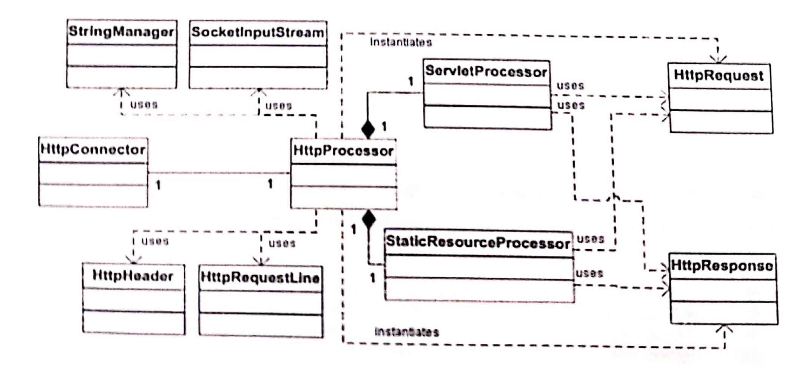

# 3장 커넥터
### 작성자

  **추연훈**

## 목표

- HTTP 요청 헤더를 파싱해 서블릿이 헤더, 쿠키, 파라미터 이름/값 등의 정보를 받을 수 있게 커넥터를 만든다.
- `Response` 클래스의 getWriter 메소드를 구현한다.

<br/>

## StringManager 클래스

- 톰캣은 특정 패키지마다 프로퍼티 파일을 만들고 이곳에 저장된 에러 메시지를 사용함으로써 에러 메시지 편집을 용이하게 만들었다. 그리고 이러한 **프로퍼티 파일은 모두 `org.apache.catalina.util.StringManager` 클래스의 인스턴스가 처리**한다. 따라서 톰캣이 구동되면 특정 패키지마다 존재하는 프로퍼티 파일을 읽기 위해 `StringManager` 인스턴스가 여러개 생성된다.

- 자원낭비를 줄이기 위해 `StringManager` 클래스는 **동일한 패키지 안의 모든 클래스가 공유**해 사용하도록 설계됐다.

- `StringManager` 클래스는 **싱글톤 클래스로 구현**되었으며 `StringManager`의 **정적 메소드인 getManager에 패키지 명을 전달해 호출**한다.

```java
//private으로 생성된 하나의 생성자를 두기 때문에 외부에서 new 키워드로 생성이 불가능하다.
private static Hashtable managers = new Hashtable();

//getManager메소드를 통해 자신의 인스턴스를 생성한다.
public synchronized static StringManager getManager(String packageName){

  StringManager mgr = (StringManager) managers.get(packageName);

  if (mgr = null){
    mgr = new StringManager(packageName);
    managers.put(packageName,mgr);
  }

  return mgr;
}
```

<br/>

## 애플리케이션



- HTTP 요청을 기다리는 역할은 `HttpConnector` 인스턴스가, 요청 및 응답 객체를 생성하는 역할은 `HttpProcessor`가 담당한다.
- HTTP 요청은 `javax.servlet.http.HttpServletRequest`를 구현하는 `HttpRequest`에 해당된다. `HttpRequest` 객체는 `HttpServletRequest` 인스턴스로 캐스팅돼 서블릿의 service 메소드로 전달된다.
- HTTP 요청의 파싱에는 문자열 처리와 연산이 매우 많이 수행되므로, 서블릿에서 필요로 하는 값만 파싱하게 되면 CPU 자원을 상당히 절약할 수 있다.
- `HttpProcessor` 클래스는 자신의 parse 메소드를 사용해 HTTP 요청의 요청 라인과 헤더를 파싱한다. 파싱된 결과 값은 `HttpProcessor` 객체의 필드에 할당된다.

<br/>

#### 애플리케이션의 구동

 - Bootstrap 클래스를 통해 애플리케이션을 시작한다.

> `Bootstrap` 클래스

 ```java
public final class Bootstrap{
  public static void main(String[] args){
    HttpConnector connector = new HttpConnector();
    connector.start();
  }
}
 ```

<br/>

#### 커넥터
- `HttpConnector` 클래스는 들어오는 HTTP 요청을 기다렸다가 서버 소켓을 생성하는 역할을 한다.

> `HttpConnector` 클래스

```java
public class HttpConnector implements Runnable{
  boolean stopped;
  private String scheme = "http";

  public String getScheme(){
    return scheme;
  }

  public void run(){
    ServerSocket serverSocket = null;
    int port = 8080;

    try{
      // 서버 소켓 생성
      serverSocket = new ServerSocket(port, 1, InetAddress.getByName("127.0.0.1"));

    }
    catch(IOException e){
      e.printStackTrace();
      System.exit(1);
    }

    while(!stopped){
      // HTTP 요청을 기다린다.
      Socket socket = null;

      try{
        socket = serverSocket.accept();

      }
      catch(Exception e){
        continue;
      }

      // 각 요청에 대해 HttpProcessor의 인스턴스를 생성한다.
      // HttpProcessor의 process 메소드를 호출한다.
      HttpProcessor processor = new HttpProcessor(this);
      processor.process(socket);
    }

    public void start(){
      Thread thread = new Thread(this);
      thread.start();
    }
  }
}
```

<br/>

- `HttpProcessor` 클래스의 process 메소드는 들어오는 HTTP 요청에서 소켓을 받는다.


> `HttpProcessor` 클래스의 process 메소드

```java
public void process(Socket socket){
  SocketInputStream input = null;
  OutputStream output = null;

  try{
    input = new SocketInputStream(socket.getInputStream(), 2048);
    output = socket.getOutputStream();

    // HttpRequest 객체의 생성 및 파싱
    request = new HttpRequest(input);

    // HttpResponse 객체의 생성
    response = new HttpResponse(output);
    response.setRequest(request); // 헤더 정보를 클라이언트에 전달할 수 있다.

    response.setHeader("Server", "Pyrmont Servlet Container");
    parseRequest(input, output);
    parseHeaders(input);

    // 서블릿에 대한 요청인지 정적 자원에 대한 요청인지 확인
    // 서블릿에 대한 요청은 "/servlet/"으로 시작
    if(request.getRequestURI().startsWith("/servlet/")){
      ServletProcessor processor = new ServletProcessor();
      processor.process(request, response);
    }
    else{
      StaticResourceProcessor processor = new StaticResourceProcessor();
      processor.process(request, response);
    }

    // 소켓 닫기
    socket.close();
    // 종료 명령은 존재하지 않음.

  }
  catch (Exception e){
    e.printStackTrace();

  }
}
```


<br/>

#### HttpRequest 객체 생성하긔

- `HttpRequest` 클래스에 들어오는 HTTP 요청의 헤더, 쿠키 및 파라미터 값은 다음의 참조 변수에 저장 된다.

``` java
protected Map<,> headers = new HashMap<>();
protected List<> cookies = new ArrayList<>();
protected ParameterMap parameters = null;

```

- HTTP 요청을 파싱하는 작업은 다음과 같이 분류되어 진행된다.
1. 소켓의 입력스트림 값 읽기
2. 요청 라인의 파싱
3. 헤더의 파싱
4. 쿠키의 파싱
5. 파라미터 얻기

<br/>

**1. 소켓의 입력스트림 값 읽기**

- 메소드, URI, HTTP 버전 정보를 담고 있는 요청 라인은 `java.io.InputStream` 클래스의 read 메소드를 써서 얻을 수 있다.

- readRequestLine과 readHeader 메소드를 사용하기 위해 `SocketInputStream`을 사용한다.

- `SocketInputStream` 인스턴스는 `InputStream` 객체와 사용할 버퍼 크기를 나타내는 정수 값을 전달해 생성한다.

<br/>

**2. 요청 라인의 파싱**

- `HttpProcessor`의 process 메소드는 HTTP 요청의 첫 줄의 내용을 파싱하려는 목적으로 parseRequest 메소드를 호출한다.

<br/>

**3. 헤더의 파싱**

- HTTP 헤더는 `HttpHeader` 클래스로 나타낸다. `HttpHeader` 인스턴스는 파라미터가 없는 디폴트 생성자를 호출함으로써 생성 가능하다.

- `HttpHeader` 인스턴스는 `SocketInputStream`의 readHeader 메소드로 전달할 수 있다.

<br/>

**4. 쿠키의 파싱**

- 쿠키는 브라우저가 HTTP 요청 헤더로서 서버로 전송한다. 이 헤더명은 "Cookie"이며, 그 값은 둘 이상의 쿠키의 이름/값 쌍이 된다.

<br/>

**5. 파라미터 얻기**

- `HttpRequest` 클래스에 있는 파라미터 메소드의 구현은 항상 자신의 parseParameters 메소드를 먼저 호출함으로써 시작된다.

- 서블릿 프로그래머는 파라미터 값을 변경할 수 없어야 한다. 이러한 이유로 파라미터는 일반적인 `HashMap` 대신, `org.apache.catalina.util.ParameterMap`이라는 특별한 HashMap에 저장된다.

> `ParameterMap` 클래스는 `java.util.HashMap` 을 확장하고, locked라는 boolean 타입의 필드를 갖고 있다. 파라미터 이름/값 쌍을 추가, 갱신, 제거하려면 locked의 값은 반드시 false이어야 한다. locked의 값이 true일 때 그와 같은 조작을 시도하면 `IllegalStateException`이 던져진다. 그러나 파라미터 값을 읽는 것은 언제든지 가능하다.

<br/>

#### HttpResponse 객체 생성하긔

- `HttpResponse` 클래스는 `javax.servlet.http.HttpServletResponse` 인터페이스를 구현한 것이다.


```java
public PrintWriter getWriter() throws IOException {
  ResponseStream newStream = new ResponseStream(this);
  newStream.setCommit(false);

  // OutputStreamWriter를 사용하면 지정한 문자셋을 사용해 문자를 바이트로 인코딩하는 것이 가능하다
  OutputStreamWriter osr = new OutputStreamWriter(newStream, getCharacterEncoding());

  // ResponseWriter 클래스는 모든 print와 println 메소드를 재정의함으로써, 이들 메소드를 호출할 때 자동으로 OutputStream에 내용을 쓸 수 있게 한다.
  writer = new ResponseWriter(osr);

  return writer;
}
```

<br/>

>>>>>> 톰캣 최종분석 요약 글입니다.
