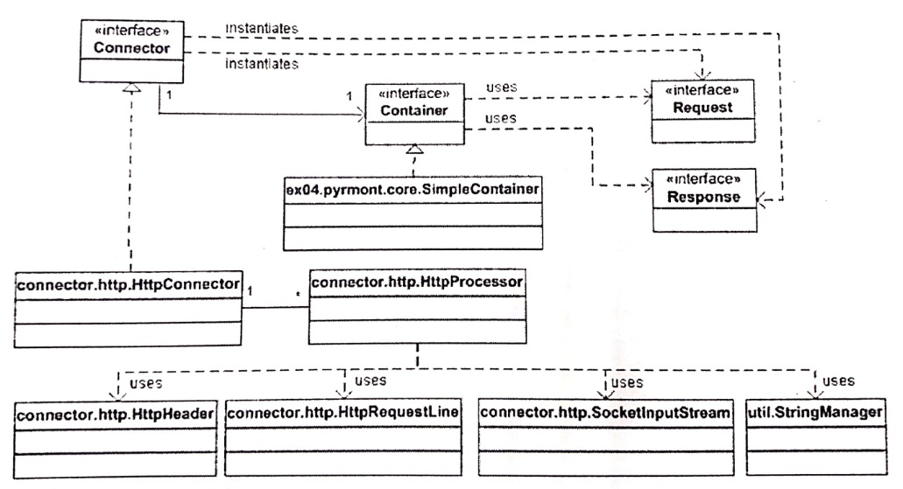

# 4장 톰캣의 기본 커넥터
### 작성자

  **추연훈**

## 목표

- 기본 커넥터는 몇 가지 최적화 기법을 사용
  - 다양한 객체를 위한 풀을 제공함으로써 과도한 객체 생성을 방지
  - 코드 내의 다양한 곳에서 문자열(String) 대신 문자의 배열(array)을 사용
- HTTP1.1의 새로운 특징
- `org.apache.catalina.Connector` 인터페이스 설명
- `HttpConnector`나 `HttpProcessor`의 발전된 형태 구현

<br/>

## HTTP 1.1의 새로운 특징
####1. 지속 연결

- 지속 연결을 사용하면 서버는 페이지가 다운로드 되자마자 연결을 닫는 것이 아니라, **웹 클라이언트가 페이지에서 필요로 하는 다른 자원들을 요청할 때까지 기다린다.**

- HTTP 연결을 맺고 끊는 것이 상당히 부담이 되는 작업이므로 이 매커니즘은 웹서버, 클라이언트, 네트워크 부하를 모두 줄일 수 있다.

<br/>

####2. 청크 인코딩

- 지속 연결이 가능해짐으로써 서버는 여러 자원에 대한 바이트 스트림을 전송할 수 있게 됐으며, 클라이언트는 동일한 연결을 사용해 다중 요청을 할 수 있게 됐다.
=> 미리 컨텐츠 길이는 알 수 없더라도, 바이트를 해석하는 방법을 수신받는 측에 알릴 수 있는 별도의 수단이 필요

- HTTP 1.1에서는 transfer-encoding이라는 특별한 헤더가 추가됐는데, 이 헤더는 **바이트 스트림이 청크(chunk) 단위로 전송될 것임을 가리킨다.**

<br/>

####3. 100 (continue) 상태 코드 사용
- HTTP 1.1 클라이언트는 Expect: 100-continue 헤더를 전송해, 요청 본체를 전송하기에 앞서 서버측의 승인을 기다릴 수 있다.
- **클라이언트가 전송하고자 하는 요청 본체의 양이 많을 경우, 서버가 이를 받아들일 수 있는지 먼저 확인하고자 할 때 사용된다.**

<br/>

## Connector 인터페이스

- setContainer: 커넥터와 컨테이너를 연결할 때 사용
- getContainer: 이 커넥터와 연결된 컨테이너를 리턴
- creatRequest: 들어오는 HTTP 요청에 대한 요청 객체 생성
- createResponse: 응답 객체 생성

<br/>



## HttpConnector 클래스
####1. 서버 소켓의 생성

- `HttpConnector`의 initialize 메소드는 자신의 open 메소드를 호출해 `ServerSocket` 인스턴스를 얻는다.
- open메소드에서는 `ServerSocket`의 생성자를 호출하는 것이 아니라 `ServerSocketFactory`로부터 `ServerSocket`을 얻는다. (디자인 패턴 - 팩토리 메소드 패턴)

<br/>

> HttpConnector의 initialize 메소드와 open 메소드

```java
public void initialize()
throws LifecycleException {
    if (initialized)
        throw new LifecycleException (
            sm.getString("httpConnector.alreadyInitialized"));

    this.initialized=true;
    Exception eRethrow = null;

    try {
        //자신의 open메소드 호출
        serverSocket = open();
    } catch (IOException ioe) {
        .................. 생략

}

//ServerSocketFactory에서 ServerSocket 인스턴스를 얻는다.
private ServerSocket open()
    throws IOException, KeyStoreException, NoSuchAlgorithmException,
           CertificateException, UnrecoverableKeyException,
           KeyManagementException
    {

        // ServerSocketFactory 호출
        ServerSocketFactory factory = getFactory();

        // 주소가 없으면 전체 주소와 연결한다.
        if (address == null) {
            log(sm.getString("httpConnector.allAddresses"));
            try {
                //serverSocket을 리턴값으로 준다.
                return (factory.createSocket(port, acceptCount));
            } catch (BindException be) {
                throw new BindException(be.getMessage() + ":" + port);
            }
        }

        // 특정 주소에만 ServerSocket을 연결한다.
        try {
            InetAddress is = InetAddress.getByName(address);
            log(sm.getString("httpConnector.anAddress", address));
            try {
                //serverSocket을 리턴값으로 준다.
                return (factory.createSocket(port, acceptCount, is));
            } catch (BindException be) {
                throw new BindException(be.getMessage() + ":" + address +
                                        ":" + port);
            }
        } catch (Exception e) {
            log(sm.getString("httpConnector.noAddress", address));
            try {
                return (factory.createSocket(port, acceptCount));
            } catch (BindException be) {
                throw new BindException(be.getMessage() + ":" + port);
            }
        }

    }
```

<br/>

####2. `HttpProcessor` 인스턴스의 관리

- `HttpConnector`는 `HttpProcessor` 객체의 풀을 가지며, 각 `HttpProcessor` 인스턴스는 자신의 스레드를 가지기 때문에 `HttpConnector`는 동시에 여러 HTTP 요청을 처리할 수 있게 된다.

- `HttpProcessor` 인스턴스는 HTTP 요청 라인과 헤더를 파싱하고 요청 객체를 만들어야 하는 책임이 있다.

- 각 `HttpProcessor`는 요청/응답 객체와 연관돼있으므로, `HttpProcessor`의 생성자 메소드 내에서 `HttpConnector` 클래스의 creatRequest와 createResponse 메소드를 호출한다.

<br/>

####3. HTTP 요청의 공급

- HTTP 요청이 들어오면 createProcessor 메소드로 `HttpProcessor` 인스턴스를 얻는다. 그러나 `HttpProcessor`가 최대 개수에 도달하면 소켓을 닫아서 들어오는 HTTP 요청을 처리하지 않게 되고 createProcessor는 null을 리턴한다.

- chap04장부터는 소켓의 입력 스트림을 읽어 HTTP 요청을 파싱하는 일은 `HttpProcessor`의 몫이 된다.

- assign 메소드는 `HttpProcessor`가 파싱을 완료할 때까지 기다리는 것이 아니라, 호출된 후에 바로 리턴함으로써 그 다음 들어오는 HTTP 요청을 곧바로 처리할 수 있게 한다.

<br/>

## `HttpProcessor` 클래스

- `HttpProcessor`에서 run메소드의 while 루프는 await 메소드를 호출하는 부분에서 정지된다. await 메소드는 `HttpConnector`로부터 새로운 소켓을 얻을 때까지 '프로세서 스레드'의 흐름을 보류시킨다.


```java
//HttpProcessor의 await 메소드와 assign 메소드

  // HttpProcessor의 run메소드 안에서 실행된다
  //소켓이 들어오면 소켓을 리턴해주는 역할을 한다
  private synchronized Socket await() {

        // 새로운 소켓을 얻을 때까지 프로세서 스레드 흐름을 보류시킨다
        // 처음 available 값은 false 이다.
        while (!available) {
            try {
              // 프로세서 스레드가 일시정지 된다
              // 새로운 소켓이 들어오면 assign 메소드에서 스레드를 깨워준다
                wait();
            } catch (InterruptedException e) {
            }
        }

        // 새로운 소켓을 할당받으면 지역 socket 변수에 할당하여 리턴한다.
        Socket socket = this.socket;

        // false로 바꿔 assign 메소드가 정상 동작하도록 한다.
        available = false;

        // 커넥터 스레드는 assign 메소드의 while 루프 내에 정지해 있어 스레드를 깨워준다.
        notifyAll();

        if ((debug >= 1) && (socket != null))
            log("  The incoming request has been awaited");

        // 지역 socket 변수를 리턴하는 이유는 현재의 소켓이 처리되기 전이라 할지라도,
        // 인스턴스 socket 변수는 다음에 들어오는 소켓을 곧바로 할당 받을 수 있어야하기 때문이다.
        return (socket);

  }

  // 소켓이 들어오면 동작하는 메소드이다
  synchronized void assign(Socket socket) {

          while (available) {
              try {
                  // 커넥터 스레드가 정지한다.
                  // await 메소드에서 커넥터 스레드를 깨워준다.
                  wait();
              } catch (InterruptedException e) {
              }
          }

          // 소켓을 지역 socket 변수에 할당한다.
          this.socket = socket;

          // true로 바꿔주면 await 메소드 루프에서 빠져나온다.
          available = true;

          // 프로세서 스레드는 다시 깨어난다. 이때 await 메소드에 알리는 것이다.
          notifyAll();

          if ((debug >= 1) && (socket != null))
              log(" An incoming request is being assigned");

    }

```

<br/>

## 요청 처리

- `HttpProcessor` 클래스의 process 메소드의 역할

1. 연결 정보의 파싱
2. 요청의 파싱
3. 헤더의 파싱

####1. 연결 정보의 파싱

- parseConnection 메소드는 소켓에서 인터넷 주소값을 얻어 `HttpRequestImpl` 객체에 입력한다
- 프락시가 사용되고 있는지도 확인해 소켓을 요청 객체에 넘긴다.

```java
// HttpProcessor 클래스의 parseConnection메소드

private void parseConnection(Socket socket)
    throws IOException, ServletException {

    if (debug >= 2)
        log("  parseConnection: address=" + socket.getInetAddress() +
            ", port=" + connector.getPort());

    // 인터넷 주소값 추출
    ((HttpRequestImpl) request).setInet(socket.getInetAddress());

    // 프록시 확인
    if (proxyPort != 0)
        request.setServerPort(proxyPort);
    else
        request.setServerPort(serverPort);
    request.setSocket(socket);

}
```

<br/>

####2. 요청의 파싱

- parseReqeust 메소드에서 요청 라인을 파싱해 다양한 값을 얻어내며, 이 값을 `HttpRequest` 객체에 할당한다.

- parseRequest 메소드가 요청 라인의 HTTP 메소드, URI, 프로토콜 정보, 질의문, jsessionid을 추출한다.

- parseReqeust 메소드는 uri를 normalize 메소드에 넘겨 비정상적인 URI를 바로 잡는다. 예를 들어 역슬래시(\\)는 모두 슬래시(/)로 바뀐다.

<br/>

####3. 헤더의 파싱

- 헤더의 파싱은 parseHeaders 메소드에서 수행되며 `HttpHeader` 클래스와 `DefaultHeaders` 클래스를 사용한다.
- `HttpHeader` 클래스는 HTTP 요청헤더를 나타내며 문자열 대신 문자의 배열을 사용함으로써 String 객체의 과도한 연산을 피하고 있다.
- 더이상 읽을 헤더가 없을 때까지 HTTP 요청을 읽어 들이는 while 루프가 있으며 헤더 값을 추출한다.
- 마지막으로 parseHeaders 메소드는 헤더의 이름과 `DefaultHeaders`에 정의된 표준 이름을 비교하며, 문자열이 아니라 2개의 문자 배열을 비교한다.


<br/>

>>>>>> 톰캣 최종분석 요약 글입니다.
