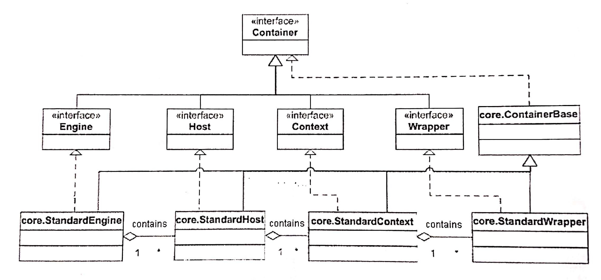
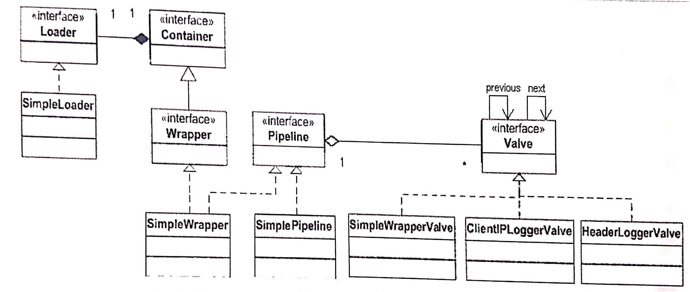
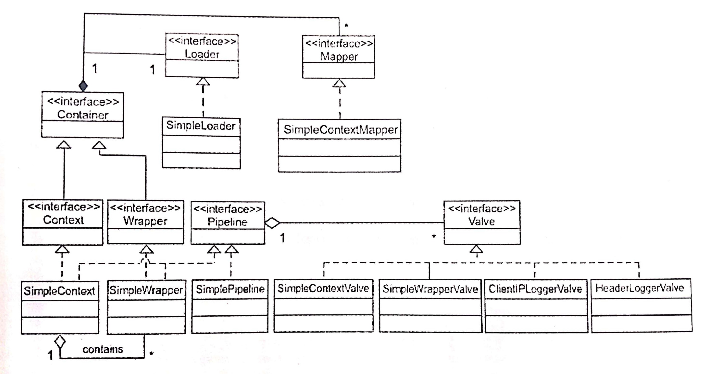

# 5장 컨테이너
### 작성자

  **추연훈**

## 목표

- 컨텍스트(context)와 래퍼(wrapper)를 설명한다.
- `Container` 인터페이스를 살펴본 후, 컨테이너의 파이프라인 매커니즘을 알아본다.

<br/>

## `Container` 인터페이스

- 컨테이너는 반드시 `org.apache.catalina.Container`를 구현해야 한다. 컨테이너 인스턴스는 커넥터의 setCotainer 메소드에 전달돼 커넥터가 컨테이너의 invoke 메소드를 호출하게 한다.

- 카탈리나 컨테이너는 각기 다른 개념적 단계에 따라 네 종류의 컨테이너가 존재한다.
  - **엔진(Engine)은 카탈리나 서블릿 엔진 전체를 나타낸다.**
  - **호스트(Host)는 다양한 컨텍스트에 따른 가상 호스트를 나타낸다.**
  - **컨텍스트(Context)는 웹 어플리케이션을 나타내며 둘 이상의 래퍼를 가진다.**
  - **래퍼(Wrapper)는 각각의 서블릿을 나타낸다.**

- 위에서 말한 각각의 개념적인 단계는 `org.apache.catalina` 패키지의 Engine, Host, Context, Wrapper 인터페이스로 표현되고 이들은 모두 `Container` 인터페이스를 확장한다.

- 컨테이너에는 하위 단계의 컨테이너가 없을 수도 있고 반대로 하위 컨테이너가 많이 있을 수도 있다. 컨테이너 하나에 하위 컨테이너를 추가할 때는 `Container` 인터페이스의 addChild 메소드를 사용하면 된다. 반대로 컨테이너로부터 하위 컨테이너를 제거하려면 removeChild 메소드를 사용하면 된다.

- `Container` 인터페이스에서 각각의 하위 컨테이너나 하위 컨테이너의 집합을 찾으려면 findChild와 findChildren 메소드를 사용하면 된다.



<br/>

## 파이프라인 태스크

- 파이프라인은 컨테이너가 호출할 태스크들을 포함하여 **하나의 특정한 태스크는 밸브 하나로 표현된다.** 밸브는 전달받은 요청/응답 객체를 조작할 수 있다.

- **하나의 컨테이너는 하나의 파이프라인을 가질 수 있다.** 컨테이너의 invoke 메소드가 호출되면 컨테이너는 파이프라인으로 처리권을 넘기며, 파이프라인은 첫 번째 밸브를 호출한다. invoke 메소드는 컨테이너가 파이프라인 내의 모든 밸브를 호출할 때 처음 호출하는 메소드이다.


<br/>

#### `Pipeline` 인터페이스

- `Pipeline` 인터페이스는 새로운 밸브를 추가하거나 기존의 밸브를 제거할 수 있도록, 각각의 addValve와 removeValve라는 메소드를 제공한다.

<br/>

#### `Valve` 인터페이스

- 밸브는 요청의 처리에 대한 책임이 있는 컴포넌트이며 `Valve` 인터페이스는 하나의 밸브를 나타낸다.

```java
// 밸브는 요청의 처리에 대한 책임이 있는 컴포넌트이다.

public interface Valve {

    // 밸브가 구현한 객체에 관한 정보를 리턴하는 메소드
    public String getInfo();

    // 컨테이너가 파이프라인 내의 밸브를 호출할 때 처음 호출하는 메소드
    public void invoke(Request request, Response response,
                       ValveContext context)
        throws IOException, ServletException;


}
```

<br/>

## `Wrapper` 인터페이스

- **래퍼는 개별적인 하나의 서블릿을 대변하는 컨테이너**이다. `Wrapper`의 구현 클래스는 각각의 **서블릿의 생명주기**를 책임지며, 래퍼는 가장 하위 단계의 컨테이너이므로 래퍼에 또 다시 하위 컨테이너를 추가할 수 없다.

- `Wrapper` 인터페이스의 중요한 메소드는 allocate와 load이며, allocate 메소드는 초기 서블릿 인스턴스를 래퍼에 할당하고 load 메소드는 래퍼가 대변하는 서블릿 인스턴스를 로드하고 초기화한다.

<br/>

## `Context` 인터페이스

- **컨텍스트는 웹 어플리케이션을 나타내는 컨테이너**이다. 컨텍스트는 하위 컨테이너로서 보통 둘 이상의 래퍼를 갖고 있다.

<br/>

## 래퍼 어플리케이션 = 가장 하위 단계의 컨테이너

- 다음의 래퍼 어플리케이션은 가장 작은 컨테이너 모듈을 작성하는 방법을 보여준다.



1) `SimpleLoader`: **컨테이너 내에서 서블릿 클래스를 로드하는 임무를 가졌다.** 서블릿 클래스들이 위치하는 곳을 알고 있으며 getClassLoader 메소드를 통해 java.lang.ClassLoader 인스턴스를 리턴하는데, 이 `ClassLoader` 인스턴스가 서블릿 클래스의 위치에서 해당 서블릿을 찾는다.

2) `SimplePipeline`: **컨테이너가 호출할 태스크들을 포함하여 하나의 특정한 태스크는 밸브 하나로 표현한다.** 밸브는 전달받은 요청/응답 객체를 조작할 수 있다.

3) `SimpleWrapper`: **서블릿 생명주기와 관련한 역할을 하는 클래스**이다. allocate와 load 메소드를 구현한다. allocate 메소드는 초기 서블릿 인스턴스를 래퍼에 할당하고 load 메소드는 래퍼가 대변하는 서블릿 인스턴스를 로드하고 초기화한다.

4) `SimpleWrapperValve`: 이 클래스는 **SimpleWrapper 클래스를 위해 요청을 처리하는 기본 밸브**이다. invoke 메소드는 래퍼가 표현하고 있는 서블릿 인스턴스를 얻으려는 목적으로 SimpleWrapper 클래스의 allocate 메소드를 호출한다. 기본 밸브는 래퍼 자체가 아닌 서블릿의 service 메소드를 직접 호출하는 것이다.

5) `ClientIPLogeerValve`: **클라이언트의 IP 주소를 콘솔에 출력하는 밸브이다.** invoke 메소드에서 처음 하는 일은 밸브 컨텍스트의 invokeNext 메소드를 사용해 파이프라인의 다음 밸브를 호출한다. 그 다음 요청 객체의 getRemoteAddr 메소드로부터 얻은 값을 포함해 몇 줄의 문자열을 출력한다.

6) `HeaderLoggerValve`: **요청 헤더의 값을 콘솔에 출력하는 밸브이다.** invoke 메소드에서 밸브 컨텍스트의 invokeNext 메소드를 사용해 파이프라인의 다음 밸브를 호출하며, 그 다음 몇가지 요청 헤더의 값을 출력한다.

7) `Bootstrap1`: 애플리케이션을 시작하는 데 사용된다.

<br/>

## 컨텍스트 어플리케이션 = 래퍼보다 상위 컨테이너

- 대부분의 웹 어플리케이션은 **다수의 서블릿**을 갖는데 이 경우 래퍼와는 다른 종류의 컨테이너인 컨텍스트가 필요하다.

- **둘 이상의 래퍼를 가지려면 맵퍼(mapper)라는 것이 필요**한데, 맵퍼는 컨테이너가 특정한 요청을 처리할 하위 컨테이너를 선택하는 것을 도와주는 컴포넌트이다.

> 맵퍼는 톰캣 4에서만 존재한다. 톰캣 5는 하위 컨테이너를 찾을 때 다른 방법을 사용한다.

- 하나의 컨테이너는 다중 프로토콜을 지원하기 위해 다수의 맵퍼를 사용할 수 있다.



처리 순서를 정리하자면...

0. HTTP 요청이 들어오면 커넥터는 컨텍스트의 invoke 메소드를 호출한다.

1. 하나의 컨테이너는 하나의 파이프라인을 갖는다. **컨테이너의 invoke 메소드는 파이프라인의 invoke 메소드를 호출한다.**

2. **파이프라인의 invoke 메소드는 컨테이너에 추가된 모든 밸브를 호출한 다음 기본 밸브의 invoke 메소드를 호출한다.**

3. **래퍼의 기본 밸브는 관련된 서블릿 클래스를 로드하고 요청에 대한 응답을 할 책임을 진다.**

4. 컨텍스트의 기본 밸브는 요청을 처리하는 책임을 가지는 하위 컨테이너에 찾기 위해 맵퍼를 이용한다. **하위 컨테이너를 찾은 후에는 그 컨테이너의 invoke 메소드를 호출한다. 그 다음 1단계로 돌아간다.**

<br/>

#### `SimpleContext` 클래스

- `SimpleContext` 클래스는 **커넥터에 할당되는 주된 컨테이너**이다. `SimpleContext`가 각각의 요청에 대해 어떤 래퍼를 호출해야 하는지 결정할 수 있게 하려면 요청 URL 패턴을 래퍼의 이름과 맵핑해야 한다.

- 매핑과 관련된 메소드는 다음과 같다.
  - addServletMapping: URL 패턴/래퍼의 이름을 추가한다.
  - findServletMapping: 주어진 URL 패턴으로 래퍼의 이름을 얻어온다.
  - addMapper: 컨텍스트에 맵퍼를 추가한다
  - findMapper: 원하는 맵퍼를 찾을 때 사용한다.
  - map: 해당 요청을 처리할 책임이 있는 래퍼를 리턴한다.

<br/>

#### `Bootstrap2` 클래스

- `Bootstrap1` 클래스와 거의 비슷하지만 2개의 래퍼를 생성하고 컨텍스트에 로더가 추가된다.

<br/>

## 요약

- 컨테이너는 **로더, 로거, 매니저**와 같은 여러 다른 모듈들을 사용한다.
- 컨테이너의 종류로는 **엔진, 호스트, 컨텍스트, 래퍼**가 있다.

<br/>

>>>>>> 톰캣 최종분석 요약 글입니다.
