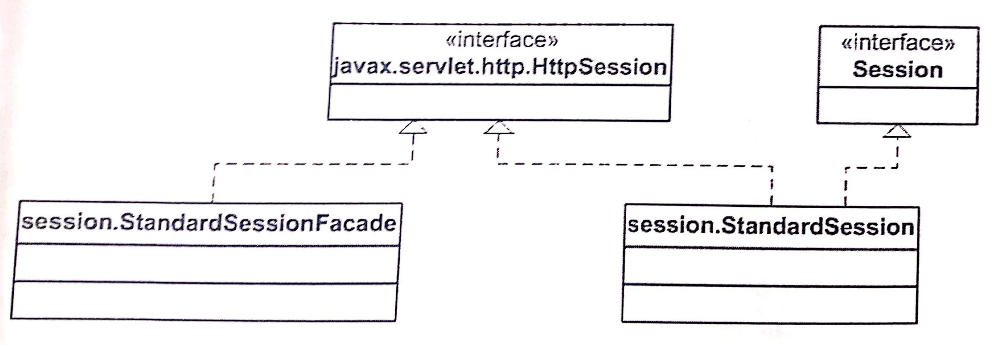
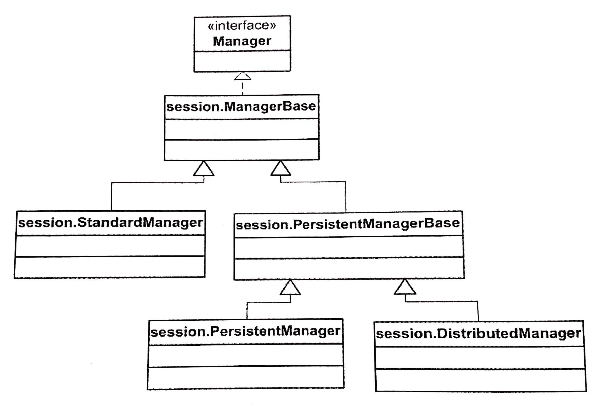
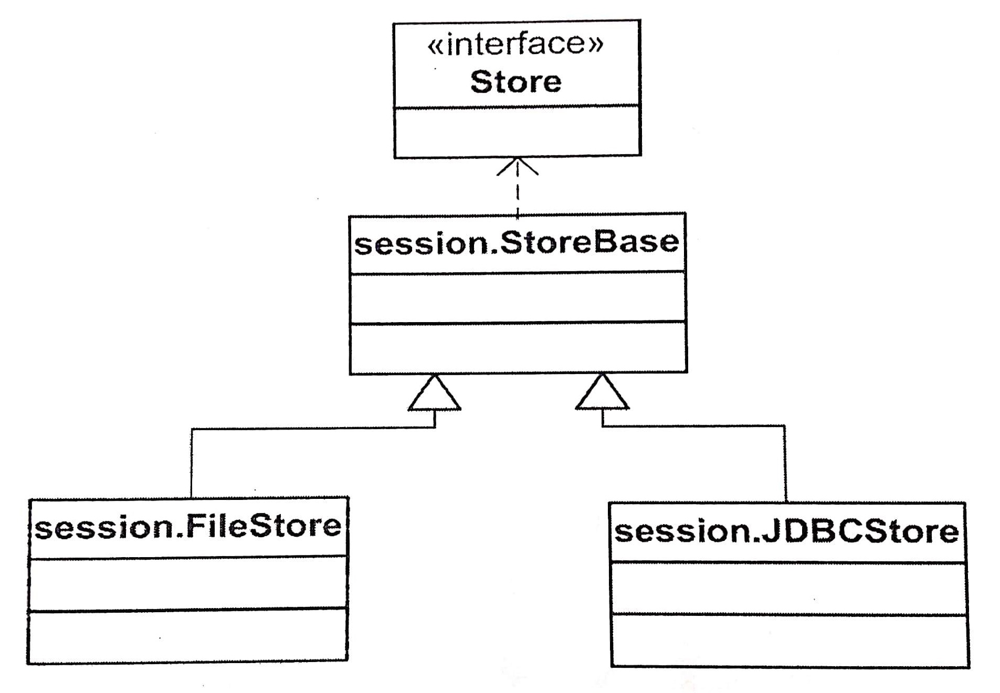

# 9장 세션 관리
### 작성자

  **추연훈**

## 서론: 당신이 궁금한 세션에 대해서
#### 세션이란 무엇일까?
- 서버가 해당 서버로 접근한 클라이언트(사용자)를 식별하기 위해 서버에 저장하는 파일을 말한다.

#### 세션을 사용하는 이유는?
- HTTP 통신은 통신이 끝나면 상태 정보를 유지하지 않는 특성이 있다. 이 특징을 해결하기 위해 쿠키와 세션을 사용한다.
- 세션은 쿠키를 기반으로 하지만, 사용자 정보 파일을 브라우저에 저장하는 쿠키와 달리 세션은 서버 측에서 관리한다.
- 서버는 클라이언트를 구분하기 위해 세션ID를 부여하며 웹 브라우저가 서버에 접속해서 브라우저를 종료할 때까지 인증상태를 유지한다.

#### 세션의 동작 순서
1. 클라이언트가 서버로 접속(http)한다.
2. 서버는 접근한 클라이언트의 쿠키를 확인해 클라이언트가 해당 session-id를 보내왔는지 확인한다.
3. 클라이언트로부터 발송된 session-id가 없으면, 서버는 session-id를 생성해 클라이언트에게 응답하고 이 session-id를 서버에 저장한다.
4. 클라이언트가 브라우저를 닫거나 세션 Time 한계(기본 30분) 시 session-id은 소멸된다.

<br/>

## 본론: 톰캣 내에서 일어나는 세션 관리

- 카탈리나는 **매니저라는 컴포넌트를 통해 세션을 관리한다.**
- 하나의 매니저는 하나의 컨텍스트와 항상 연결되어 있다.
- 매니저는 세션 객체를 생성, 갱신, 제거(무효화)하는 일 외에도 유효한 세션 객체를 요청한 컴포넌트에게 리턴해주는 역할도 한다.
- 매니저는 기본적으로 세션 객체를 메모리에 저장한다.
> 톰캣은 매니저가 세션 객체를 파일이나 데이터베이스에 지속적으로 저장하는 것도 허용

<br/>

## 세션



- 세션 객체는 `HttpSession` 인스턴스로 대변되고 구현 클래스는 `StandardSession` 클래스이다.
- 보안상의 이유로 매니저는 `StandardSession` 인스턴스를 서블릿에 전달하지 않고 대신에 `StandardSessionFacade` 라는 퍼사드 클래스를 사용한다.
- 내부적으로 매니저는 Session 인터페이스와 함께 작동된다.

<br/>

#### `Session` 인터페이스

- `Session` 인터페이스는 카탈리나의 내부 퍼사드로서 작동한다.

> 퍼사드 패턴은 서브시스템 내부에 있는 클래스에 접근할 수 있는 하나의 통합된 인터페이스를 제공하는 패턴이다.

- `Session` 객체는 언제나 매니저와 연결돼있으며, setManager와 getManager 메소드를 사용해 `Session` 객체를 매니저에 연결할 수 있다.
- `Session` 객체는 매니저와 연결돼있는 컨텍스트 내에서 유일한 식별자를 갖는다.

<br/>

#### `StandardSession` 클래스

- `Session` 인터페이스의 표준 구현 클래스이다.
- 생성자 메소드에서 `Manager` 인스턴스를 받음으로써 `Session` 객체가 항상 `Manager`를 갖고 있게 한다.
- `Manager`의 maxInactiveInterval 변수에 지정된 시간동안 한번도 접근된 적이 없는 `Session` 객체는 만료되어야 한다.

> 세션이 만료가 되면 서버에서 저장하고 있던 사용자의 세션 정보를 삭제한다. 대부분의 웹 컨테이너의 기본값은 1800초(30분)이다.

- `Session` 인터페이스의 expire 메소드를 호출함으로써 `Session` 객체를 만료시킬 수 있다.

<br/>

#### `StandardSessionFacade` 클래스

- 카탈리나는 `StandardSessionFacade`의 인스턴스를 서블릿에 전달한다. 이렇게 함으로써 서블릿 프로그래머가 사용해서는 안되는 `StandardSession`의 메소드를 호출하는 것을 방지할 수 있다.

<br/>

## 매니저

- 매니저는 세션 객체를 관리한다.



- `ManagerBase` 클래스는 모든 매니저 클래스들이 확장해야 하는 **추상 클래스**이다. `MangerBase`는 Session 객체를 생성하기 위한 createSession 메소드를 갖고 있다. **모든 세션은 각각 유일한 식별자를 갖는데, `ManagerBase` 클래스의 generateSessionid 메소드는 해당 세션의 유일한 식별자를 리턴한다.**

```java
// 세션ID 만드는 알고리즘

protected synchronized String generateSessionId() {

    // 랜덤 값을 추출하여 byte 배열에 저장
    Random random = getRandom();
    byte bytes[] = new byte[SESSION_ID_BYTES];
    getRandom().nextBytes(bytes);
    bytes = getDigest().digest(bytes);

    // 16진법으로 전환
    StringBuffer result = new StringBuffer();
    for (int i = 0; i < bytes.length; i++) {
        byte b1 = (byte) ((bytes[i] & 0xf0) >> 4);
        byte b2 = (byte) (bytes[i] & 0x0f);
        if (b1 < 10)
            result.append((char) ('0' + b1));
        else
            result.append((char) ('A' + (b1 - 10)));
        if (b2 < 10)
            result.append((char) ('0' + b2));
        else
            result.append((char) ('A' + (b2 - 10)));
    }
    return (result.toString());

}
```

<br/>

#### `StandardManager` 클래스

- `Manager` 인터페이스의 표준 구현 클래스로서, 기동시 세션 객체를 메모리에 저장한다. 그러나 준지될 때는 현재 메모리에 존재하는 모든 세션 객체를 파일로 저장한다. 다시 기동될 때는 파일로부터 세션 객체를 다시 로드한다.

- processExpire 메소드는 루프를 돌면서 `StandardManager`가 관리하는 모든 `Session` 인스턴스의 lastAccessedTime의 값을 현재 시각과 비교하는 루프를 수행하여 maxInactiveInterval의 값을 초과하면 Session 인스턴스의 expire 메소드를 호출해 `Session`을 만료시킨다.

<br/>

#### `PersistentManagerBase` 클래스

- 지속 매니저에서 세션 객체는 백업(back-up)될 수도 있고 스왑 아웃(swap-out)될 수도 있다.

- **세션 객체가 백업될 때 세션 객체는 저장장치에 복사되며 원래의 세션 객체는 여전히 메모리에 남는다.** 따라서 서버에 이상이 생겼을 때는 활성 세션 객체를 저장장치로부터 다시 읽어올 수 있다.

> 여기서 저장장치란 세션 객체가 저장될 보조기억장치를 말한다.

- **세션 객체가 스왑 아웃될 때 세션 객체는 저장장치로 이동되는데 메모리 공간의 절약을 위해서이다.** 이는 세션 객체가 너무 오랫동안 사용되지 않았거나 활성 세션 객체의 수가 지정된 세션의 수를 초과했기 때문이다.

<br/>

**스왑 아웃**

- `PersistentManagerBase` 클래스는 세션 객체를 스왑 아웃시키는 데 있어서 여러 가지 규칙을 적용한다.
    - 너무 많은 세션 객체가 존재할 경우 -> 단순히 아무 세션 객체나 스왑 아웃시키게 된다.
    - 세션 객체가 너무 오랫동안 사용되지 않은 경우

<br/>

**백업**

- 모든 활성 세션 객체가 백업되는 것은 아니다.
- maxIdleBackup의 값보다 더 오랫동안 사용되지 않은 세션 객체만을 백업한다.

<br/>

#### `DistributedManager` 클래스

- `DistributedManager` 클래스는 둘 이상의 노드로 구성된 클러스터 환경에서 사용된다. 하나의 노드는 하나의 톰캣 서버를 말한다.

- `DistributedManager`의 주된 역할은 세션 복제이다.

> 세션 복제는 클러스터 환경에서 사용자의 세션을 보장하는 하나의 방법으로 세션 클러스터링(session clustering)의 한 종류이다. 이로 인해 사용자의 HTTP 요청은 어떤 노드(톰캣)에 전달되더라도 기존에 생성한 동일한 세션 정보를 사용할 수 있게 된다.

<br/>

## `Store` 인터페이스

- `Store` 인터페이스는 매니저에 의해 관리되는 세션들을 저장하기 위한 지속적인 저장장치를 제공하는 컴포넌트이다.



1) `StoreBase`: 하위 클래스인 `FileStore`와 `JDBCStore`를 위해 공통 기능을 제공하는 **추상클래스**이다. 정기적으로 세션을 만료시킬지의 여부를 확인하고 **만료된 세션을 활성 세션을 집합으로부터 제거하는 역할을 맡는 별도의 스레드가 실행된다.**
2) `FileStore`: **세션 객체를 파일에 저장한다.** 파일이름은 세션 객체의 식별자와 동일하며 .session이라는 확장자가 붙는다.
3) `JDBCStore`: JDBC를 사용해 세션 객체를 데이터베이스에 저장한다.

<br/>

## 참고

https://interconnection.tistory.com/74

<br/>

>>>>>> 톰캣 최종분석 요약 글입니다.
