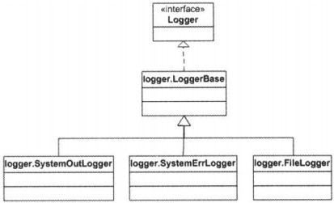

# 7장 - 로거

### 작성자

임수빈

## 로거

메시지를 기록해주는 컴포넌트

카탈리나에서의 로거는 컨테이너와 연결되어있으며, 다른 컴포넌트에 비해 상대적으로 간단하다
org.apache.catalina.logger 패키지에 다양한 로거 제공함.

__* 모든 로거는 org.apache.catalina.logger 인터페이스를 구현해야함.__

logger인터페이스는 이 인터페이스를 구현하는 클래스에서 선택할 수 있는 다양한 종류의 log메소드를 정의해놓고 있다.
#### - Logger interface
```java
import java.beans.PropertyChangeListener;

public interface Logger{
public static final int FATAL = Integer.MIN_VALUE;
public static final int ERROR = 1;
public static final int WARNING = 2;
public static final int INFORMATION =3;
public static final int DEUG = 4;

public Container getContainer();
public void setContainer(Container container);
public String getInfo();
public int getVerbosity();
public void setVerbosity(int verbosity);
public void addPropertyChangeListener(PropertyChangeListener listener);
public void log(String message);
public void log(Exception exception, String msg);
public void log(String message, Throwable throwable);
public void log(String message, int verbosity);
public void log(String message, Throwable throwable, int verbosity);
public void removePropertyChangeListener(PropertyChangeListener listener);
}
```
단 하나의 String을 전달받는 메소드인데, 문자열은 기록할 메시지 

log 메소드 2개 출력수준 (verbosity level)을 받는 메소드
클래스의 인스턴스에 지정된 출력 수준보다 낮은 수준의 값을 log메소드에 전달하면 로그메시지가 기록되며,
그렇지 않은 경우 메시지는 무시됨.

### 출력 수준
	FATAL (항상), ERROR (1), WARNING (2), INFORMATION (3), DEBUG (4) 
getVerbosity, setVerbosity메소드는 출력수준의 값을 얻거나 설정할 때 사용

추가로 Logger인터페이스는 연결돼있는 컨테이너와 관련한 getContainer와 setContainer메소드를 제공함


### Logger 종류
	SystemErrLogger, SystemOutLogger, FileLogger 
톰캣은 3개의 Logger를 제공함.

모두 org.apache.catalina.logger 패키지에 있으며, org.apache.catalina.logger.LoggerBase 클래스를 확장하고 있다.
### LoggerBase
LoggerBase클래스는 log(String msg)메소드를 제외한 Logger인터페이스의 모든 메소드를 구현해놓은 추상 클래스

	public abstract void log(String msg);
하위 클래스는 서로 다른 대상에 메시지를 기록할 수 있기 때문이다.
따라서, 이 메소드는 LoggerBase클래스에서 구현되어있지 않다

>톰캣5에서의 LoggerBase클래스는 추가로 LifeCycle과 MBeanRegistration 인터페이스를 구현함.


```java
	//출력 수준을 설정하는 메소드
    public void setVerbosityLevel(String verbosity) 
    {
        if ("FATAL".equalsIgnoreCase(verbosity))
            this.verbosity = FATAL;
        else if ("ERROR".equalsIgnoreCase(verbosity))
            this.verbosity = ERROR;
        else if ("WARNING".equalsIgnoreCase(verbosity))
            this.verbosity = WARNING;
        else if ("INFORMATION".equalsIgnoreCase(verbosity))
            this.verbosity = INFORMATION;
        else if ("DEBUG".equalsIgnoreCase(verbosity))
            this.verbosity = DEBUG;
    }
    
    // 출력수준보다 낮은 로그 출력
    public void log(String message, int verbosity) 
    {
        if (this.verbosity >= verbosity)
            log(message);
    }
```


### SystemOutLogger
이 하위클래스는 log(String msg)메소드를 구현하고 있는데, 전달받은 모든 메시지는
System.out.println 메소드로 다시 전달한다.
```java
public class SystemOutLogger extends LoggerBase
{
	protected static final String info = "org.apache.catalina.logger.SystemOutLogger/1.0";
	
	public void log(String msg)
	{
		System.out.println(msg);
	}
}
```

### SystemErrLogger
이 클래스는 log(String)메시지가 System.err.println()으로 전달되는 것 외에 동일함.
```java
public class SystemErrLogger extends LoggerBase
{
	protected static final String info = "org.apache.catalina.logger.SystemOutLogger/1.0";
	
	public void log(String msg)
	{
		System.err.println(msg);
	}
}
```

### FileLogger
 LoggerBase의 하위 클래스 중 가장 복잡한 클래스
 연결되어있는 컨테이너로부터 메시지를 받아 파일에 기록함.  각 메시지 별로 타임스탬프를 같이 기록할 수도 있다. 
 처음 이 클래스의 인스턴스가 생성되면, 날짜 정보를 포함하는 이름을 갖는 파일을 생성한다.
 날짜가 바뀌면 다시 새로운 날짜를 이름으로 갖는 파일을 생성함.
  또, 이 클래스는 로그 파일의 이름에 접두어나 접미어를 붙일 수 있는 방법도 제공함.

FileLogger클래스 내부
```java
public class FileLogger extends LoggerBase implements Lifecycle 
{
	...
	
	public void start() throws LifecycleException 
	{
    // 현재 컴포넌트의 상태를 검증 및 갱신함
        if (started)
            throw new LifecycleException(sm.getString("fileLogger.alreadyStarted"));
        lifecycle.fireLifecycleEvent(START_EVENT, null);
        started = true;
	}
	public void stop() throws LifecycleException 
	{
        // 현재 컴포넌트의 상태를 검증 및 갱신함
        if (!started)
            throw new LifecycleException(sm.getString("fileLogger.notStarted"));
        lifecycle.fireLifecycleEvent(STOP_EVENT, null);
        started = false;
        close();
    }
    /* 받은 메시지를 로그파일에 기록함 FileLogger인스턴스의 생명주기동안, 
       log메소드는 여러개의 파일을 열고 닫을 수 있다. 
       일반적으로, log메소드는 날짜가 바뀐 경우 현재의 파일을 닫고 새 파일을 여는 형식으로 
       로그파일을 전환한다.
		
		Timestamp클래스는 nanoseconds까지 나타냄 (19자)
		yyyy-mm-dd hh:mm:ss.fffffffff
    */
    public void log(String msg) 
    {
        // 타임스탬프 데이터의 생성
        Timestamp ts = new Timestamp(System.currentTimeMillis());
        String tsString = ts.toString().substring(0, 19);
        String tsDate = tsString.substring(0, 10);

        // 필요하다면 타임스탬프를 붙여 메시지를 기록
        if (!date.equals(tsDate)) 
        {
            synchronized (this) {
                if (!date.equals(tsDate)) {
                    close();
                    date = tsDate;
                    open();
                }
        }
    }
	 /* 로그 파일을 생성하려는 디렉토리가 이미 존재하는지 확인
		존재하지 않으면 새디렉토리 생성
		PrintWrtier 인스턴스 생성 -> FileWriter객체를 사용하여 pathname에 해당하는 파일에 쓰기작업실행
	*/
    private void open() 
    {
        // 필요하면 디렉토리를 생성시킴
        File dir = new File(directory);
        if (!dir.isAbsolute())
            dir = new File(System.getProperty("catalina.base"), directory);
        dir.mkdirs();

        // 현재 로그 파일을 연다
        try {
            String pathname = dir.getAbsolutePath() + File.separator +
                prefix + date + suffix;
            writer = new PrintWriter(new FileWriter(pathname, true), true);
        } catch (IOException e) {
            writer = null;
        }
    }
    /* writer버퍼의 내용을 스트림에 쓰게하고 printerWriter를 닫은 후 null을 할당함*/
    private void close() 
    {
        if (writer == null)
            return;
        writer.flush();
        writer.close();
        writer = null;
        date = "";
    }
    ...
}
```
### 6장의 BootStrap에 로거 추가
```java
import org.apache.catalina.Connector;
import org.apache.catalina.Context;
import org.apache.catalina.Lifecycle;
import org.apache.catalina.LifecycleListener;
import org.apache.catalina.Loader;
import org.apache.catalina.logger.FileLogger;
import org.apache.catalina.Mapper;
import org.apache.catalina.Wrapper;
import org.apache.catalina.connector.http.HttpConnector;

public final class Bootstrap {
  public static void main(String[] args) {
    Connector connector = new HttpConnector();
    Wrapper wrapper1 = new SimpleWrapper();
    wrapper1.setName("Primitive");
    wrapper1.setServletClass("PrimitiveServlet");
    Wrapper wrapper2 = new SimpleWrapper();
    wrapper2.setName("Modern");
    wrapper2.setServletClass("ModernServlet");
    Loader loader = new SimpleLoader();

    Context context = new SimpleContext();
    context.addChild(wrapper1);
    context.addChild(wrapper2);

    Mapper mapper = new SimpleContextMapper();
    mapper.setProtocol("http");
    LifecycleListener listener = new SimpleContextLifecycleListener();
    ((Lifecycle) context).addLifecycleListener(listener);
    context.addMapper(mapper);
    context.setLoader(loader);
    // context.addServletMapping(pattern, name);
    context.addServletMapping("/Primitive", "Primitive");
    context.addServletMapping("/Modern", "Modern");

    // ********* 로거 추가 *********
    System.setProperty("catalina.base", System.getProperty("user.dir"));
    FileLogger logger = new FileLogger();
    logger.setPrefix("FileLog_");
    logger.setSuffix(".txt");
    logger.setTimestamp(true);
    logger.setDirectory("webroot");
    context.setLogger(logger);

    //---------------------------

    connector.setContainer(context);
    try {
      connector.initialize();
      ((Lifecycle) connector).start();
      ((Lifecycle) context).start();

      // make the application wait until we press a key.
      System.in.read();
      ((Lifecycle) context).stop();
    }
    catch (Exception e) {
      e.printStackTrace();
    }
  }
}
```
  
 