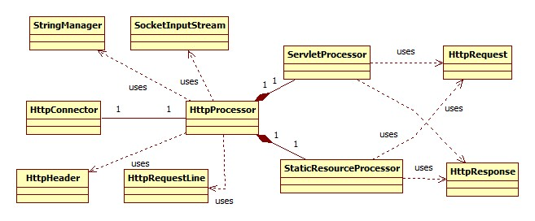
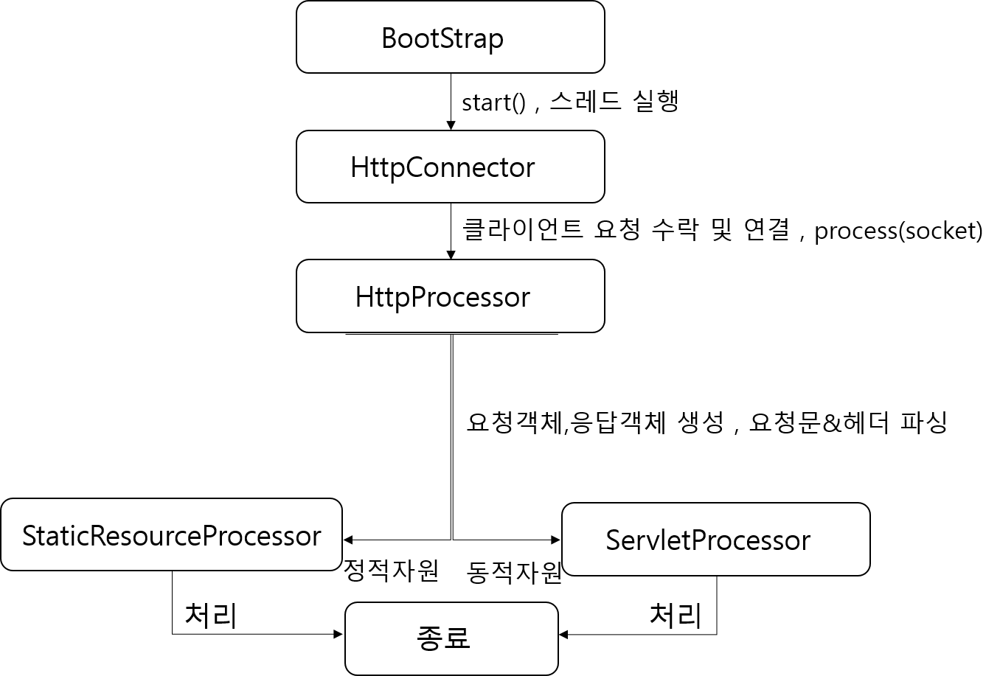

# 3장 커넥터

### 작성자

**남기웅**

## 학습 목표

- 커넥터의 역할을 이해한다.

- 2장의 애플리케이션보다 개선된 사항을 이해한다.

## 전체적인 그림 

애플리케이션은 크게 3개의 모듈로 나뉘어져 있다.

| 구성모듈  |                             역할                             |
| :-------: | :----------------------------------------------------------: |
|  startup  |                      main theread 실행                       |
| connector | 클라이언트 요청대기 및 통신소켓 생성, 요청메시지 파악 후 처리객체 생성 |
|   core    |                     해당 요청 처리 객체                      |

애플리케이션의 개략적인 흐름은 다음과같다.

1. <b>Bootstrap</b> 클래스에서 <b>main 스레드를 실행</b>하고 main스레드가 실행되면 <b>HttpConnector</b> 객체를 생성 후 <b>start()</b>를 실행
2. <b>start()</b> 메소드 에서는 <b>서버소켓 생성 후 accept()</b> , 요청이 들어오면 새로운 통신소켓을 생성하여 클라이언트와 통신할 준비를 하고 <b>HttpProcessor 객체</b>를 생성후 소켓객체를 넘겨주면서 <b>process()</b>를실행한다.
3.  <b>process()</b>는 <b>HttpRequest(요청)객체와 HttpResponse(응답)객체를 생성</b>하고 요청메시지를 파싱하여 정적자원에 대한 요청인지 동적자원에 대한 요청인지 판단 후, <b>정적요청</b>이면  <b>StaticResourceProcessor 객체</b>를 <b>동적요청이면 ServletProcessor 객체</b>를 생성하여 실행한다.
4. , 요청결과를 클라이언트에게 전송해주고 통신은 종료된다.

## 커넥터

<b>목적</b> : 자원요청을 기다리는 부분을 하나의 모듈로 만듬으로써 유지보수 및 기능확장을 쉽게하기위함.

<b>기능</b>

- 클라이언트로부터의 요청을 기다리고 요청이들어오면 새로운 통신소켓을 만들어 통신한다.
- 요청객체와 응답객체를 생성한다. 

## StringManager  클래스

<b>목적</b> : 대형 애플리케이션에서 에러 발생시 , 에러에 대한 인지 및 해결을 손쉽게 하기위한 class

<b>방법</b>

- 각 패키지에 properties 파일에 각 에러사항에 대한 메시지를 mapping 시켜 적어놓는다.

- 각 패키지의 클래스는 여러개이므로 메모리공간을 효율적으로 관리하기 위해 싱글톤 패턴을 적용

- 에러가 발생시 StringManager는 패키지 내에 properties파일을 읽어들여 발생 에러와 mapping

  되 있는 에러메시지를 출력한다.

## 애플리케이션

<b>실행 흐름</b>

## 2장과의 비교

- 커넥터 class를 정의하여 클라이언트로부터의 요청을 수락 및 소켓생성 부분을 모듈화하였다.
- 요청객체는 요청 헤더를 파싱할 수 있으며 , 파라미터 값을 얻을 수 있도록 발전하였다.
- 응답객체는 PrintWriter의 print()또한 autoflush기능을 갖도록 성능을 개선하였다. 

