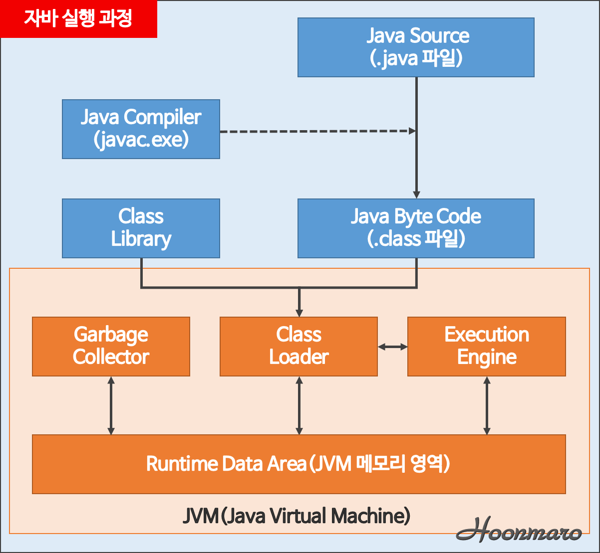
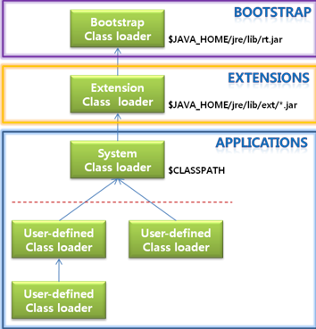
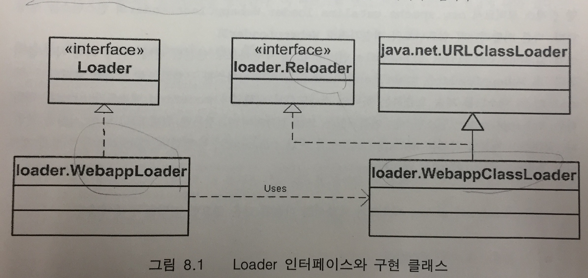

# 8. 로더

### 작성자

남기웅

## 학습 목표

- 톰캣에서의 클래스로더를 이해한다.

## JVM(자바 가상 머신)

클래스로더는 JVM의 method area에 .class file을 적재시켜주는 역할을 한다. 

톰캣에서는 하나의 JVM객체를 여러 컨텍스트가 공유해서 쓰며 각각의 컨텍스트는 자기자신만의

로더를 가진다.

## 클래스로더

- 자바 클래스로더

| 클래스로더 |                     설명                      |
| :--------: | :-------------------------------------------: |
| BootStrap  | JVM이 실행되기 위해 필요한 .class 파일을 로드 |
| Extension  |          Java의 기본 package를 load           |
|   System   |      사용자가 작성한 .class 파일을 로드       |

일반적인 클래스로더는 위임(delegation)모델을 기준으로 하여 동작한다. 

- 위임모델 : 어떤 객체를 실행해야할 경우 , 그 객체의 클래스 파일이 메모리에 적재되어 있지 않을경우 하위 클래스 로더인 system 이 바로 탐색하지 않고 상위 클래스 로더에게 위임하는 모델.

## Tomcat 클래스 로더

Tomcat 클래스 로더는 일반 JAVA 클래스 로더와는 기능이 다르다.  그 이유로는 다음과 같은 두가지

이유가 있다.

1.  보안 문제 : Tomcat 클래스 로더는 접근 디렉토리를 WEB-INF/classes , WEB-INF/lib 로 제한되어야 한다. CLASSPATH를 접근할 수 없어야 한다.  또한 하나의 컨텍스트 컨테이너는 자기자신만의

   로더를 가지고 있어야 한다.

2. 재로딩(Leloading) : 서블릿 파일이 update되면 톰캣을 끄지 않고 재적재할 수 있어야 한다.

=> Tomcat의 클래스 로더는 보안상의 목적을 위하여 기존의 위임모델이 아닌 하위 클래스 로더부터

클래스의 탐색을 시작한다.   

## 클래스 다이어그램

| 클래스 (or 인터페이스) | 설명                                                        |
| ---------------------- | ----------------------------------------------------------- |
| Loader                 | 클래스 로더의 기본 인터페이스                               |
| Reloader               | 재적재 기능을 정의한 인터페이스                             |
| URLClassLoader         | WebappClassLoader의 상위개념                                |
| WebappLoader           | 실제 클래스 로더를 실행시키며 접근제어 , 리로딩을 하는 객체 |
| WebappClassLoader      | 컨텍스트가 갖는 개별적인 클래스 로더                        |

## 참고 문헌

톰캣 최종분석